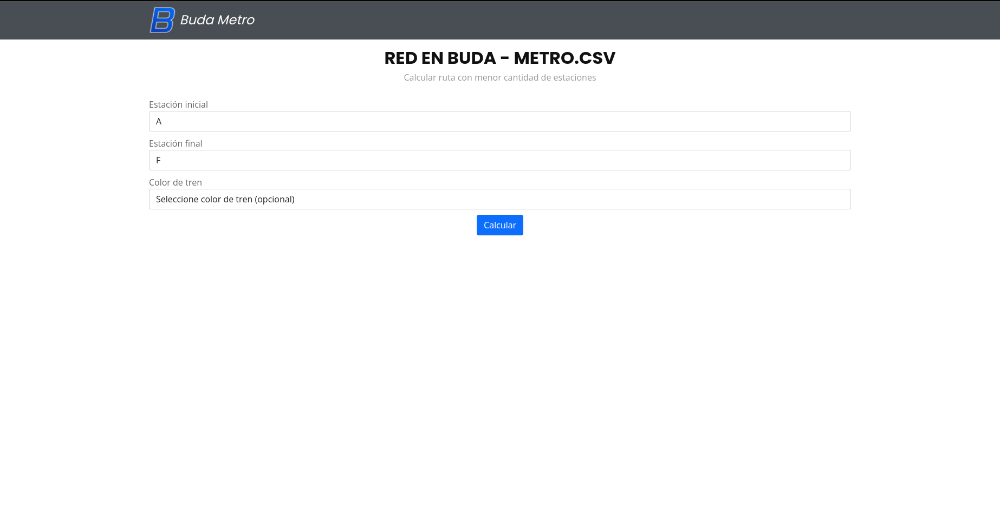

<div id="top"></div>

# Buda Metro
Es una aplicación web que permite cargar una red de metro y calcular la ruta con menor cantidad de estaciones según los parámetros de entrada que se configuren (estación inicial, estación final y color de tren)

<br>

## Fotos de Pantalla





<p align="right">(<a href="#top">volver a inicio</a>)</p>

<br>

## Pre-requisitos
* [Composer 2.1](https://getcomposer.org/download/) o superior
* [PHP 8.0](https://www.tecmint.com/install-php-8-on-ubuntu/) o superior
* [npm y NodeJS](https://ubunlog.com/nodejs-npm-instalacion-ubuntu-20-04-18-04/)

<p align="right">(<a href="#top">volver a inicio</a>)</p>

<br>

## Instalación (Linux)
1. Clonar el repositorio de la aplicación en el directorio elegido
   ```sh
   git clone https://github.com/Alaneta/Buda-Metro.git .
   cd Buda-Metro
   ```

2. Instalar las dependencias de la aplicación
   ```sh
   composer install
   ```

3. Actualizar las dependencias instaladas
   ```sh
   composer update
   ```

4. Crear el archivo de variables de entorno
   ```sh
   cp .env.example .env
   ```

5. Reemplazar la información de conexión a la base de datos en el archivo .env
   ```sh
   DB_CONNECTION=mysql
   DB_HOST=mysql
   DB_PORT=3306
   DB_DATABASE=buda_metro
   DB_USERNAME=<username>
   DB_PASSWORD=<password>
   ```
   El usuario y contraseña por defecto son:
   > usuario: sail

   > contraseña: password


6. Generar la variable de entorno APP_KEY
   ```sh
   php artisan key:generate
   ```

7. Iniciar los contenedores en modo desatendido
    ```sh
    ./vendor/bin/sail up -d
    ```

8. Instalar las dependencias requeridas
   ```sh
   ./vendor/bin/sail npm install
   ```


La aplicación se estará ejecutando en el host local: http://localhost/

<p align="right">(<a href="#top">volver a inicio</a>)</p>

<br>

### Creación de Tablas
Las siguientes consultas deben ser ejecutadas para crear las tablas en la base de datos requeridas por la aplicación

```sql
SET foreign_key_checks = 0;

CREATE TABLE `networks` (
`id` int unsigned NOT NULL AUTO_INCREMENT,
`name` varchar(50) NOT NULL,
`created_at` datetime DEFAULT NULL,
`updated_at` datetime DEFAULT NULL,
PRIMARY KEY (`id`)
);

CREATE TABLE `stations` (
`id` int unsigned NOT NULL AUTO_INCREMENT,
`network_id` int unsigned NOT NULL,
`name` varchar(50) NOT NULL,
`color` varchar(20) NOT NULL,
`x` int NOT NULL,
`y` int NOT NULL,
`weight` int NOT NULL DEFAULT '0',
`checkpoint` int NOT NULL DEFAULT '0',
`created_at` datetime DEFAULT NULL,
`updated_at` datetime DEFAULT NULL,
PRIMARY KEY (`id`),
KEY `fk_network_idx` (`network_id`),
CONSTRAINT `fk_network` FOREIGN KEY (`network_id`) REFERENCES `networks` (`id`) ON DELETE CASCADE
);

CREATE TABLE `station_station` (
`id` int unsigned NOT NULL AUTO_INCREMENT,
`station_id` int unsigned NOT NULL,
`connected_station_id` int unsigned NOT NULL,
PRIMARY KEY (`id`),
KEY `fk_station_idx` (`station_id`),
KEY `fk_station_station_idx` (`connected_station_id`),
CONSTRAINT `fk_station_station_1` FOREIGN KEY (`station_id`) REFERENCES `stations` (`id`) ON DELETE CASCADE,
CONSTRAINT `fk_station_station_2` FOREIGN KEY (`connected_station_id`) REFERENCES `stations` (`id`) ON DELETE CASCADE
);
```

<p align="right">(<a href="#top">volver a inicio</a>)</p>

<br>

## Inicio y Detenimiento de Contenedores
Para iniciar todos los contenedores
```sh
./vendor/bin/sail up
```

Para iniciar todos los contenedores en modo desatendido
```sh
./vendor/bin/sail up -d
```

Para detener todos los contenedores
```sh
./vendor/bin/sail stop
```

Para eliminar volúmenes
```sh
./vendor/bin/sail down -v
```

<p align="right">(<a href="#top">volver a inicio</a>)</p>

<br>


## Correr los test
Los archivos con los test automáticos están ubicados en la carpeta tests/Feature y tests/Unit
```sh
./vendor/bin/sail artisan test
```

## Construida con:
| [](https://laravel.com/) | [](https://www.php.net/) | [](https://www.mysql.com/) | [](https://getcomposer.org/) | [](https://sass-lang.com/) | [](https://jquery.com/) | [](https://getbootstrap.com/) |
|---|---|---|---|---|---|---|

<p align="right">(<a href="#top">volver a inicio</a>)</p>

<br>

## Autor
* **Alan Camussi** - Desarrollo - [Alaneta](https://github.com/Alaneta)

<p align="right">(<a href="#top">volver a inicio</a>)</p>

<br>
